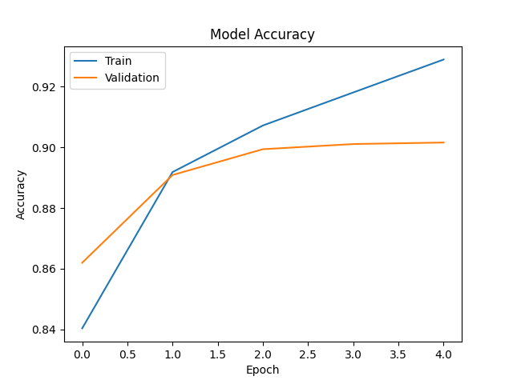

# Fashion MNIST CNN using Deep Learning

## Student Details

- **Course:** Deep Learning Techniques and Practice
- **Assignment:** CNN Implementation using Fashion MNIST
- **USN:** PES1PG25CS091

---

# Project Overview

This project implements a Convolutional Neural Network (CNN) for image classification on the Fashion MNIST dataset using TensorFlow and Keras.

The objective of this assignment is to understand the internal working of Convolutional Neural Networks including:

- Convolution Layer
- Pooling Layer
- Flatten Layer
- Fully Connected Layer
- Forward Pass
- Backpropagation
- Training and Evaluation

The model was trained on the Fashion MNIST dataset and achieved approximately **90.8% test accuracy**.

---

# About Fashion MNIST Dataset

Fashion MNIST is a dataset of grayscale clothing images containing 70,000 images divided into 10 classes.

Each image:

- Size: 28 × 28 pixels
- Color Format: Grayscale
- Total Classes: 10

The dataset contains images of:

- T-shirts
- Shoes
- Bags
- Dresses
- Coats
- Sandals
- Shirts
- Sneakers
- Pullovers
- Ankle boots

Dataset Split:

- Training Images: 60,000
- Testing Images: 10,000

---

# Libraries Used

| Library    | Purpose                   |
| ---------- | ------------------------- |
| TensorFlow | Building and training CNN |
| NumPy      | Numerical operations      |
| Matplotlib | Plotting graphs           |

---

# CNN Architecture

The CNN model contains the following layers:

---

## 1. First Convolution Layer

```python
Conv2D(32, (3,3), activation='relu')
```

### Purpose

The convolution layer extracts important visual features from the image such as:

- edges
- textures
- shapes
- patterns

### Working

- 32 filters are applied to the image.
- Each filter size is 3×3.
- Filters slide across the image and perform convolution operations.
- Feature maps are generated.

### Why ReLU?

ReLU activation introduces non-linearity and helps the network learn complex patterns.

Formula:

```text
f(x) = max(0, x)
```

---

## 2. First Max Pooling Layer

```python
MaxPooling2D((2,2))
```

### Purpose

Pooling reduces the spatial dimensions of the feature maps.

### Advantages

- Reduces computation
- Prevents overfitting
- Retains important features

### Working

The 2×2 window selects the maximum value from each region.

Example:

```text
[1 5]
[2 3]
```

Output:

```text
5
```

---

## 3. Second Convolution Layer

```python
Conv2D(64, (3,3), activation='relu')
```

### Purpose

This layer extracts deeper and more complex features.

### Improvements Over First Layer

- Detects advanced patterns
- Learns combinations of edges and textures
- Better object understanding

### Why 64 Filters?

Increasing filters allows the network to learn more detailed representations.

---

## 4. Second Max Pooling Layer

```python
MaxPooling2D((2,2))
```

Further reduces dimensions while preserving important learned features.

---

## 5. Flatten Layer

```python
Flatten()
```

### Purpose

Converts multidimensional feature maps into a one-dimensional vector.

### Why Needed?

Dense layers require 1D input.

Example:

```text
3D Tensor → 1D Vector
```

---

## 6. Fully Connected Dense Layer

```python
Dense(128, activation='relu')
```

### Purpose

Learns high-level relationships between extracted features.

### Why 128 Neurons?

Provides enough learning capacity while keeping computation manageable.

---

## 7. Output Layer

```python
Dense(10, activation='softmax')
```

### Purpose

Predicts probabilities for 10 clothing classes.

### Why Softmax?

Softmax converts outputs into probability distribution.

Example:

```text
Class probabilities:
[0.01, 0.90, 0.03, ...]
```

Highest probability becomes predicted class.

---

# Model Compilation

```python
model.compile(
    optimizer='adam',
    loss='categorical_crossentropy',
    metrics=['accuracy']
)
```

---

## Optimizer: Adam

Adam optimizer adjusts learning rates automatically and improves convergence speed.

Advantages:

- Fast convergence
- Stable training
- Efficient gradient updates

---

## Loss Function: Categorical Crossentropy

Used for multi-class classification problems.

Measures prediction error between:

- predicted probabilities
- actual labels

Lower loss indicates better predictions.

---

# Training Process

The model was trained for:

```text
5 epochs
```

---

# Epoch-wise Analysis

| Epoch | Training Accuracy | Validation Accuracy | Training Loss | Validation Loss |
| ----- | ----------------- | ------------------- | ------------- | --------------- |
| 1     | 83.65%            | 87.09%              | 0.4494        | 0.3517          |
| 2     | 88.91%            | 89.18%              | 0.3006        | 0.3014          |
| 3     | 90.52%            | 89.91%              | 0.2560        | 0.2738          |
| 4     | 91.72%            | 90.37%              | 0.2239        | 0.2693          |
| 5     | 92.46%            | 90.81%              | 0.1985        | 0.2570          |

---

# Analysis of Training Results

## Accuracy Improvement

The training accuracy increased steadily from:

```text
83.65% → 92.46%
```

This indicates that the CNN successfully learned important image features.

---

## Loss Reduction

The training loss reduced from:

```text
0.4494 → 0.1985
```

This shows:

- prediction errors reduced
- model confidence improved
- network weights optimized successfully

---

## Validation Performance

Validation accuracy also improved continuously, reaching:

```text
90.81%
```

This demonstrates good generalization on unseen data.

---

# Final Model Performance

| Metric        | Value  |
| ------------- | ------ |
| Test Accuracy | 90.81% |
| Test Loss     | 0.2570 |

---

# Accuracy Graph

The following graph shows the improvement in training and validation accuracy over epochs.



---

# Key Learnings

Through this assignment, the following concepts were understood:

- Working of convolution operations
- Feature extraction in CNNs
- Pooling operations
- Dense neural layers
- Backpropagation
- Model optimization
- Loss minimization
- CNN training workflow
- Deep learning model evaluation

---

# Project Structure

```text
UE24CS645BC2_PES1PG25CS091_FASHION_MNIST_CNN
│
├── cnn_fashion_mnist.py
├── README.md
├── .gitignore
├── results
│   └── model_accuracy.png
│
└── venv
```

---

# How to Run the Project

## Install Dependencies

```bash
pip install numpy matplotlib tensorflow
```

---

## Run Program

```bash
python cnn_fashion_mnist.py
```

---

# Conclusion

This project successfully implemented a CNN model for Fashion MNIST image classification.

The model achieved over 90% accuracy and demonstrated how convolutional neural networks learn hierarchical image representations through convolution, pooling, flattening, and dense layers.

The assignment provided practical understanding of CNN architecture, forward propagation, backpropagation, and model evaluation techniques in deep learning.
